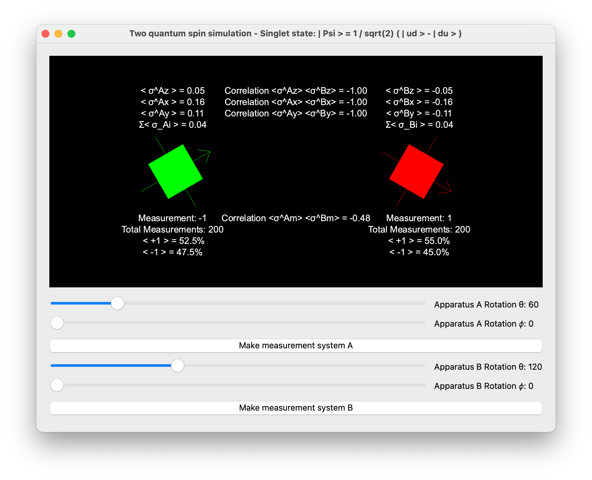

# Quantum mechanics spin simulation

Welcome to the Quantum Mechanics Spin Simulation repository. This Python-based project is designed to simulate quantum spin dynamics, providing an interactive platform to explore the fundamental principles of quantum mechanics through computational methods. Whether you're a student, educator, or researcher, this repository offers valuable tools to simulate and analyze the behavior of quantum spins under various conditions.

## Single spin simulation


The single spin simulation script allows users to simulate the quantum mechanics of a single spin system. Users can specify the orientation of a measurement apparatus in three-dimensional space and observe the behavior of a quantum spin subjected to this configuration. The simulation outputs include the probabilities of the spin aligning in either the up or down state and can be visualized in real-time to aid in understanding quantum superposition and measurement collapse.

### Features:

- **Dynamic Apparatus Orientation:** Users can input coordinates to align the measurement apparatus in any arbitrary direction.
- **Randomized Spin Measurement:** Utilizes a random number generator to simulate the probabilistic nature of quantum measurements.
- **Measurement Repeatability:** Simulate consecutive measurements to observe the quantum mechanical property of state collapse.

## Two spin simulation



The two spin simulation script extends the capabilities of the single spin simulator by introducing interactions between two spins. This script includes various predefined states such as entangled states and product states, allowing users to simulate complex quantum phenomena like entanglement and spin correlation.

### Simulation types:

- **Product States:** Simulate two independent spins in various configurations.
- **Entangled States:** Explore the intriguing properties of entangled spins with several types of entangled states available, including the singlet and triplet states.
- **Measurement Options:** Perform measurements on both spins individually or simultaneously to observe correlations directly resulting from quantum entanglement.

### Output:

- **Statistical Analysis:** The script provides detailed statistics on spin states and their correlations after multiple measurements, essential for understanding entanglement.

## EPR experiment


The EPR Experiment script simulates two entangled spins following the principles of quantum mechanics. It is designed to demonstrate the violation of Bell's theorem, highlighting the impossibility of hidden variables in quantum systems.

### Simulation types:

1. **Singlet state**: 
    - `| Psi > = 1 / sqrt(2) * (| ud > - | du >)` [DEFAULT]
2. **Triplet state I**: 
    - `| Psi > = 1 / sqrt(2) * (| ud > + | du >)`
3. **Triplet state II**: 
    - `| Psi > = 1 / sqrt(2) * (| uu > + | dd >)`
4. **Triplet state III**: 
    - `| Psi > = 1 / sqrt(2) * (| uu > - | dd >)`

Both apparatus measure at the same time. A button allows random selection of the direction, ensuring statistical measurement in the same direction ⅓ of the time.

### Measurement Options:

- **Simultaneous Measurements:** Both apparatuses measure at the same time.
- **Random Direction Selection:** A button allows for a random selection of measurement directions, resulting in a 1/3 probability of measuring the same direction.
- **Multiple Measurements:** Perform 'n' measurements with the number set via the command line option "-m, --measurement_number" (default = 100).

### Output:
- **Spin Result Colors:** Set the color for spin up `| +1 >` with the command line option "-u, --color_up" (default = green) and for spin down `| -1 >` with "-d, --color_down" (default = red).
- **Result Inversion:** By default, results are inverted for convenience in analysis. This can be overridden with the command line option "-n, --no-invert."
- **Orientation Settings:** Set the orientation of the apparatus with theta1, theta2, phi1, and phi2 in degrees (default = 0).

This script provides a comprehensive tool for simulating and analyzing the fundamental aspects of quantum entanglement and the EPR paradox.

## Getting Started

To get started with these simulations:
1. Clone the repository:
   ```
   git clone https://github.com/azimonti/quantum-entanglement-simulation.git
   ```
2. Navigate to the repository directory:
   ```
   cd quantum-entanglement-simulation
   ```
3. Install required dependencies:
   ```
   pip install -r requirements.txt
   ```
4. Run the simulation scripts:
   ```
   python single_spin_sim.py
   python two_spin_sim.py
   ```

## Contributing

Contributions to the Quantum Mechanics Spin Simulation project are welcome. Whether it's through submitting bug reports, proposing new features, or contributing to the code, your help is appreciated. For major changes, please open an issue first to discuss what you would like to change.

## License

This project is licensed under the MIT License - see the [LICENSE](LICENSE.md) file for details.

## Contact

If you have any questions or want to get in touch regarding the project, please open an issue or contact the repository maintainers directly through GitHub.

Thank you for exploring the quantum mechanics of spins with us!
